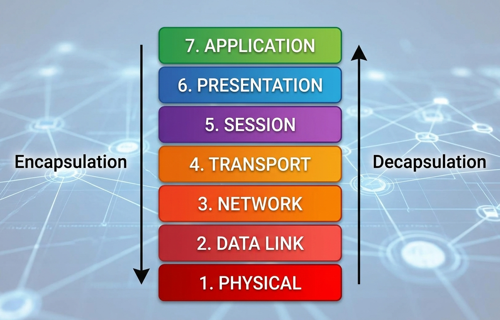
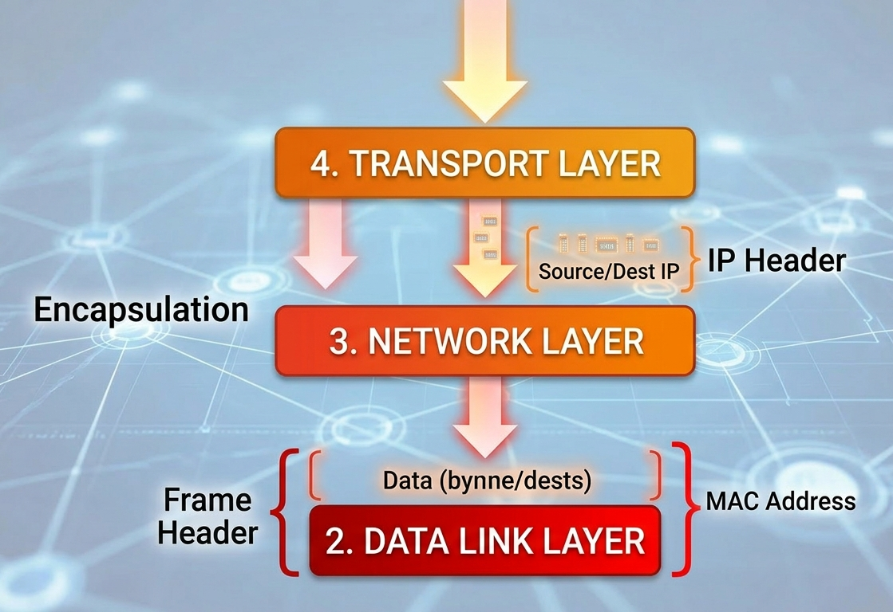

# 🌐 The OSI Model: A Deep Dive

## 📖 Introduction
The internet is the biggest machine ever built. To make it work, engineers use a blueprint called the **OSI (Open Systems Interconnection) Model**. It splits the complex job of sending data into 7 simple layers. Understanding this map is critical because hackers attack different layers.

---

## 🏭 The Analogy: The International Assembly Line
Imagine you are the manager of a super-secure toy factory. You need to send a top-secret blueprint (your **Data**) to a partner factory across the ocean. You can't just throw it in the mail; it must be prepared, broken down, addressed, and protected.

### The "Upper Layers" (Software & Meaning)
These layers exist inside your computer's operating system and the application you are using (like Chrome or WhatsApp).

* **Layer 7: Application (The User Interface)** – Where you stand. When you type a message, you interact here. It provides services like HTTP for web browsing.
* **Layer 6: Presentation (The Translator)** – Translates data into a universal language. This is where **Encryption (SSL/TLS)** and compression happen.
* **Layer 5: Session (The Connection Manager)** – Imagine a private phone line. This layer starts, manages, and ends the "conversation" between two devices.

---

## 📊 The OSI Master Cheat Sheet

| Layer | Name | Function (Analogy) | Data Unit (PDU) | Cybersecurity Context | Key Hardware |
| :--- | :--- | :--- | :--- | :--- | :--- |
| **7** | **Application** | User Interface | Data | Phishing, API attacks | Gateway |
| **6** | **Presentation** | Format/Encryption | Data | Encryption failure | N/A (OS) |
| **5** | **Session** | Connection Manager | Data | Session Hijacking | N/A (OS) |
| **4** | **Transport** | Reliability (TCP/UDP) | **Segment** | Port Scanning, SYN Floods | Firewall |
| **3** | **Network** | Routing (Path) | **Packet** | IP Spoofing, MitM | Router |
| **2** | **Data Link** | Physical Addressing | **Frame** | MAC Spoofing, ARP Poisoning | Switch, NIC |
| **1** | **Physical** | Cables/Bits | **Bits** | Cable cutting, Jamming | Cables, Hubs |

---

## 🔄 Understanding Data Flow

### 1. Encapsulation (Sending: Top to Bottom)
Visualize data moving from L7 down to L1. As it moves, each layer adds its own "envelope" (Header).
* **L4** adds port numbers (**Segment**)
* **L3** adds IP addresses (**Packet**)
* **L2** adds MAC addresses (**Frame**)
* **L1** turns it into electrical pulses (**Bits**)

### 2. Decapsulation (Receiving: Bottom to Top)
The destination computer reverses the process. It receives Bits, builds a Frame, reads the MAC, strips the header, reads the IP, and finally presents the raw Data to the user.

---

## 🛡️ Why this matters for Cybersecurity
"Understanding the OSI model is like learning the anatomy of the human body for a doctor."
* **Troubleshooting:** If the network is slow, you must identify which layer is "sick."
* **Defense:** To defend a system, you must understand exactly where the attacker is striking (e.g., a Layer 3 attack requires a different defense than a Layer 7 attack).

---

## 🧠 Memory Aids
* **Top to Bottom:** "All People Seem To Need Data Processing"
* **Bottom to Top:** "Please Do Not Throw Sausage Pizza Away"
